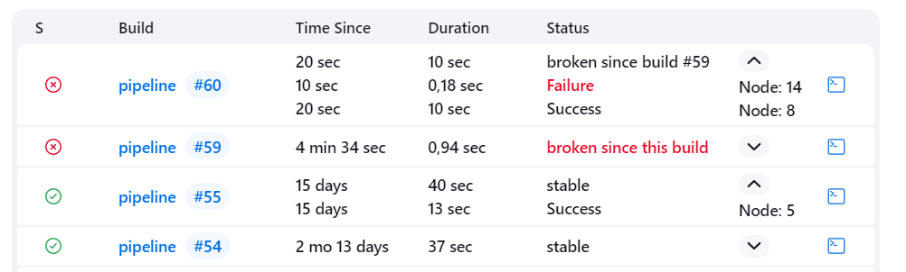
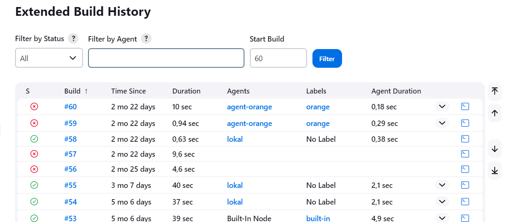

Pipeline Agent Build History
==========

## Agent History
The classical `Build History` for an agent that is available in Jenkins core is not able to show runs of Pipeline jobs
that have been executed on an agent. This plugin fills this gap by providing an additional link on an agents side panel
opening a view that shows runs of pipeline jobs but also all the other job types that are available in the original
`Build History`.

For Pipeline runs the status is the overall status. So if the pipeline failed it doesn't mean that this was something
that was executed on that specific agent. It can also be due to a step on another agent or a step outside a node step.

A button is added behind the links to the run that allows to show all node steps executed on the agent. If any step
inside the node steps closure failed the status is set to `Failure` and highlighted in red.
 
Looking at the output of this simple pipeline 
```
node('mynode') {
  sh 'Echo Hello' 
}
node('othernode') {
  sh 'echo 
}
node('mynode') {
  sh '''
    echo Hello
    exit 1
  ''' 
}
```
this will produce on the agent `mynode` the below lines


:warning: 
**Note** The plugin internally caches the usage of agents by jobs. Initially the usage of agents from finished runs is 
not loaded. When the extended build history page for agents is accessed the first time (it doesn't matter for which agent), 
the page will only contain those runs that have used an agent since Jenkins was started. At that time a background thread
starts and the plugin will load the complete history of all jobs. This can be time and memory consuming. The next time the 
extended build history page of an agent is accessed it should contain the complete history.


## Job History
Similarly, the `Trend` page of a pipeline job is not able to show information about the agents that have been used in
a run. The plugin adds a link in a jobs sidepanel to a view with an `Extended Build History`. For each run all the used 
agents are listed, together with the label expression used in the `node` step declaration and the duration of the `node`
step. When more than one agent was used in a run, click on the down arrow to show all used agents of that run.
The number of runs is now limited to 40 with paging buttons on the right that allow to jump to the start/end. 
Alternatively you can directly jump to a run via the input field at the top.

Runs can be filtered by result and/or by agent used.





## API
The plugin exposes a REST API to get the extended build history for agents and jobs in JSON and XML format similar to other Jenkins APIs.
Go to `/job/<jobname>/extendedBuildHistory/api/` or
`/computer/<agentname>/extendedBuildHistory/api/` for more details.

